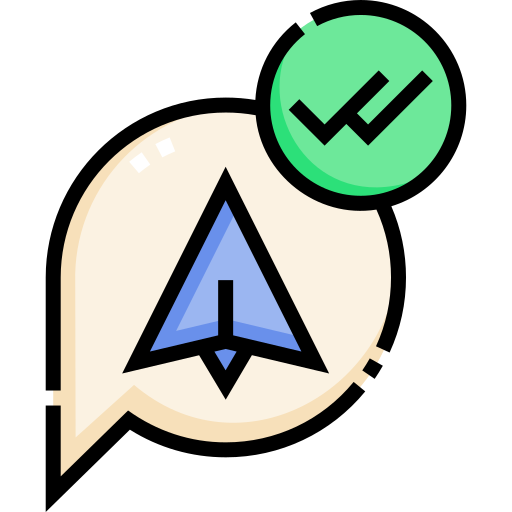

<h1 align="center">Olá! Eu sou o Eduardo. 👋</h1>

<div align="center"> 
<a href="https://web.telegram.org/z/#-1582796052" target='_blank'></a> <a href="https://linkedin.com/in/eduardokaykedasilva" target="blank"></a> <a href="https://web.telegram.org/z/#-1582796052" target="blank"></a><br><br>

</div>

<div align="left">
    
```js   
/** Sou Desenvolvedor Front-End Jr. 
 *  Você pode me encontrar pelo Telegram, Linkedin e meu Site(Em construção). 
 */    
    
function Eduardo(Front End >= 1 year) {
    const programmer = "Front-end and Game Developer";
    
    if (Front End) {
        const stack = `${HTML}, ${CSS}, ${JavaScript}` 
    }
    else (Framework) {
        const stack = `${Bootstrap}`
    }
};
